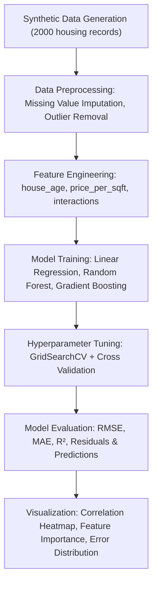

```markdown
 🏠 Housing Dataset Regression Model (ML)

An **end-to-end machine learning project** for predicting **house prices** using a **synthetic housing dataset**.  
The pipeline demonstrates **data preprocessing, feature engineering, model training, hyperparameter tuning, and advanced visualizations**.

---

 🚀 Features

- **Synthetic Data Generation** – Creates a realistic housing dataset with features like square footage, bedrooms, bathrooms, grade, zipcode, etc.
- **Advanced Preprocessing**
  - Handles missing values using **KNN Imputer**
  - Removes **outliers with IQR method**
  - Creates new features (`house_age`, `price_per_sqft`, interaction features, etc.)
- **Machine Learning Pipeline**
  - Linear Regression (with polynomial & feature selection)
  - Random Forest Regressor
  - Gradient Boosting Regressor
  - **GridSearchCV with cross-validation** for hyperparameter tuning
- **Comprehensive Model Evaluation**
  - RMSE, MAE, R²
  - Residual plots, Actual vs Predicted comparison
  - Feature importance visualization
- **Advanced Visualizations (Matplotlib + Seaborn)**
  - Model performance comparison
  - Correlation heatmap
  - Price distribution
  - Price vs Square Footage scatterplot
  - Error distribution across models

---
```

## 📂 Project Structure

```

Housing-Dataset-Regression-Model-ML/
│── app.py                # Main ML pipeline & execution script
│── requirements.txt      # Dependencies
│── README.md             # Project documentation

````

---

## ⚙️ Installation & Setup

Clone the repository:

```bash
git clone https://github.com/Atharv-M/Housing-Dataset-Regression-Model-ML.git
cd Housing-Dataset-Regression-Model-ML
````

Install dependencies:

```bash
pip install -r requirements.txt
```

Run the project:

```bash
python app.py
```

---

## 📊 Workflow

**Pipeline Overview**

```
Data Generation → Preprocessing → Feature Engineering → 
Model Training (GridSearchCV) → Evaluation → Visualization
```

1. **Synthetic Data Creation** – Generates 2000 housing records with realistic distributions.
2. **Preprocessing** – Missing value imputation (KNN), outlier detection & removal.
3. **Feature Engineering** – Derived metrics like `house_age`, `price_per_sqft`, and interaction features.
4. **Model Training** – Trains **Linear Regression, Random Forest, Gradient Boosting** with hyperparameter tuning.
5. **Evaluation** – Computes RMSE, MAE, and R².
6. **Visualization** – Creates plots for interpretability and model comparison.

---

## 🔄 Project Flowchart



---

## 📈 Example Outputs

* **Model Comparison (RMSE & R²)**
* **Actual vs Predicted Prices (Best Model)**
* **Residual Plots**
* **Feature Correlation Heatmap**
* **Top Feature Importances (Random Forest)**
* **Error Distribution Across Models**

*(All plots are automatically generated when running `app.py`)*

---

## 🧠 Technologies Used

* **Python** (Pandas, NumPy, Matplotlib, Seaborn)
* **Scikit-learn** (Pipelines, GridSearchCV, Feature Engineering, Metrics)

---

## 🔮 Future Enhancements

* [ ] Add support for real-world datasets (e.g., Kaggle Housing Prices)
* [ ] Deploy model as a **Flask / FastAPI REST API**
* [ ] Build an interactive **Streamlit dashboard**
* [ ] Explore advanced models (XGBoost, LightGBM, Neural Networks)

---

## 🎯 For Recruiters

This project demonstrates:
✔️ **End-to-end ML workflow** (data → model → evaluation → visualization)
✔️ Strong skills in:

* Data preprocessing & feature engineering
* Machine learning model selection & hyperparameter tuning
* Model evaluation & interpretation
* Visualization & storytelling with data

Easily extensible to **real business datasets** (e.g., real estate, finance, retail).

---

## 👤 Author

**Atharv Mishra**
📧 Email: [mishra17atharv@gmail.com](mailto:mishra17atharv@gmail.com)
🔗 GitHub: [Atharv-M](https://github.com/Atharv-M)
🔗 LinkedIn: [Atharv Mishra](https://www.linkedin.com/in/atharv-mishra-ab6b60277/)

```


